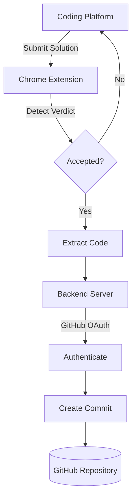
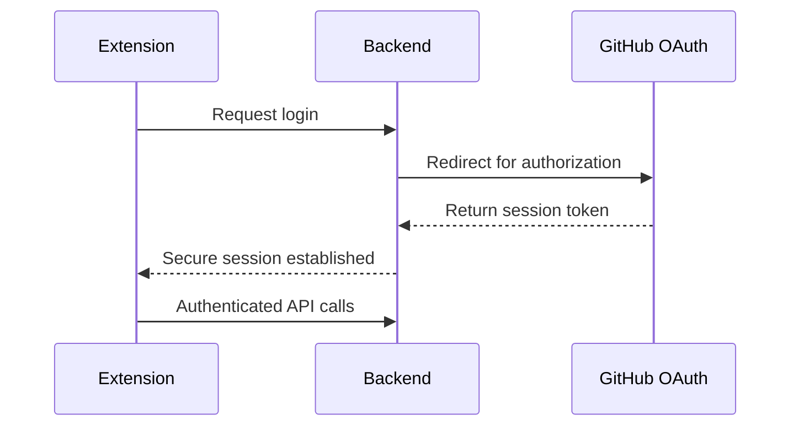

<div align="center">

# 🚀 CodeCommit

### Your competitive programming solutions, automatically committed to GitHub.

<p align="center">
  
  
  
  
  
</p>

<p align="center">
  
  
  
</p>

**No more copy-pasting solutions into GitHub by hand.**
CodeCommit detects your accepted submissions on coding platforms and pushes them straight to your repository — organized, version-controlled, and portfolio-ready.

<br/>

[Installation](#-installation) •
[Features](#-features) •
[How It Works](#-how-it-works) •
[Roadmap](#-roadmap) •
[Contributing](#-contributing)

</div>

---

## 🎬 Preview

> *Add a demo GIF or screenshots here — this is prime real estate, show the extension detecting a submission and the commit landing on GitHub.*

<div align="center">

```
LeetCode  ➜  ✅ Accepted  ➜  CodeCommit Extension  ➜  Backend  ➜  🐙 GitHub
```

</div>

---

## ✨ Features

<table>
<tr>
<td width="50%">

- ⚡ **Zero manual uploads** — fully automatic
- 🔐 **Secure GitHub OAuth** login
- 🧩 **Lightweight Chrome extension**
- 📁 **Smart repository selection**

</td>
<td width="50%">

- 🗂️ **Organized folder structure** per topic
- 🌍 **Multi-platform support** (growing)
- 🚀 **Fast**, no noticeable lag on submit
- 🔒 Tokens never stored in the extension

</td>
</tr>
</table>

---

## 🌍 Supported Platforms

| Platform | Status |
|:--|:--:|
| 🟢 LeetCode | ✅ Live |
| 🟢 Codeforces | ✅ Live |
| 🟡 HackerRank | 🚧 Coming Soon |
| 🟡 CodeChef | 🚧 Coming Soon |
| 🟡 AtCoder | 🚧 Coming Soon |

---

## 🏗️ How It Works



---

## 🔐 Authentication Flow

CodeCommit uses **GitHub OAuth** — your Personal Access Token is never stored inside the extension itself.



---

## 📂 Project Structure

```
CodeCommit/
├── codeconnect-web/          # Chrome extension
│   ├── popup.html
│   ├── popup.js
│   ├── background.js
│   ├── manifest.json
│   └── content-scripts/
│
├── codeconnect-backend/      # API + GitHub integration
│   ├── routes/
│   ├── controllers/
│   ├── lib/
│   ├── db/
│   └── server.js
│
└── README.md
```

---

## ⚙️ Tech Stack

| Layer | Stack |
|---|---|
| **Frontend** | React, HTML, CSS, JavaScript, Chrome Extension API |
| **Backend** | Node.js, Express.js, JWT, GitHub OAuth |
| **APIs** | GitHub REST API, Chrome Identity API |

---

## 🚀 Installation

**1. Clone the repository**
```bash
git clone https://github.com/flamekaiser007/CodeCommit.git
```

**2. Set up the backend**
```bash
cd codeconnect-backend
npm install
npm start
```

**3. Set up the frontend**
```bash
cd codeconnect-web
npm install
npm run dev
```

**4. Load the Chrome extension**
```
chrome://extensions  →  Enable Developer Mode  →  Load Unpacked  →  Select codeconnect-web
```

---

## 📁 Example Output

Once connected, your solved problems land in your GitHub repo like this:

```
LeetCode/
├── Arrays/
│   ├── Two Sum.cpp
│   └── Best Time to Buy Stock.cpp
├── Trees/
│   └── Binary Tree Paths.cpp
└── Graphs/
    └── Number of Islands.cpp
```

---

## 🎯 Roadmap

- [x] GitHub Authentication
- [x] Chrome Extension
- [x] Backend Server
- [x] Repository Selection
- [ ] Auto folder organization by topic
- [ ] Daily commit statistics
- [ ] Contest tracking
- [ ] Difficulty badges
- [ ] AI-generated code explanations
- [ ] Browser dashboard
- [ ] Multiple GitHub accounts
- [ ] VS Code integration

---

## 🔮 Future Vision

CodeCommit aims to become the **GitHub companion for competitive programmers** — with:

- 🤖 AI-generated README per solved problem
- 📝 Smart, automatic commit messages
- 📊 Contest history & progress analytics
- 🔥 Coding streak tracking
- 🌡️ Difficulty heatmaps
- 🔄 Multi-platform synchronization

---

## 🤝 Contributing

Contributions are always welcome!

```bash
# 1. Fork the repository

# 2. Create your feature branch
git checkout -b feature/amazing-feature

# 3. Commit your changes
git commit -m "Added amazing feature"

# 4. Push to your branch
git push origin feature/amazing-feature

# 5. Open a Pull Request
```

---

<div align="center">

## ⭐ Support the Project

If CodeCommit saved you time, consider giving it a star — it really helps!

<br/>

**Built with ❤️ by [Arpit Maurya](https://github.com/flamekaiser007)**

*"Every accepted solution deserves a commit."*

</div>

